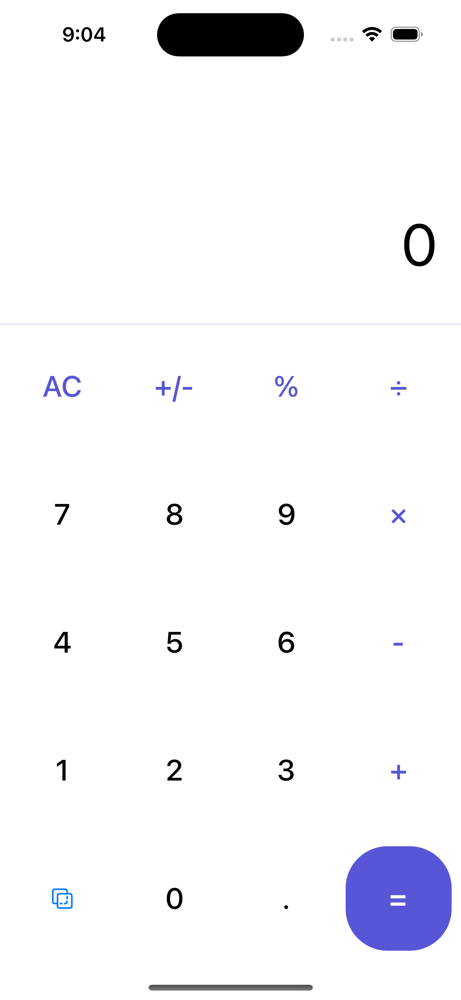
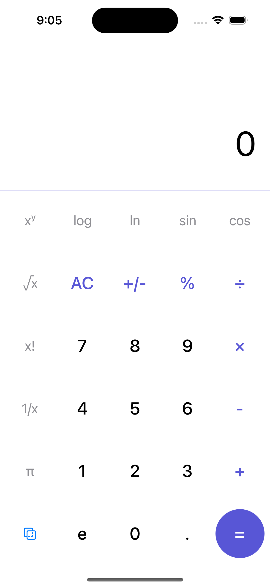
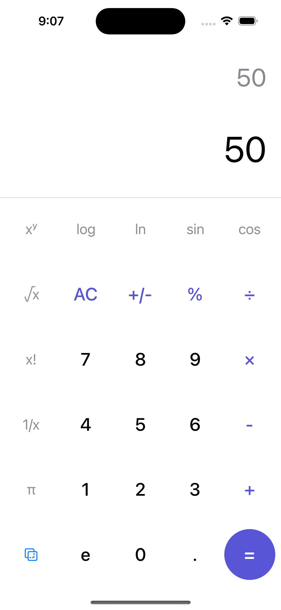
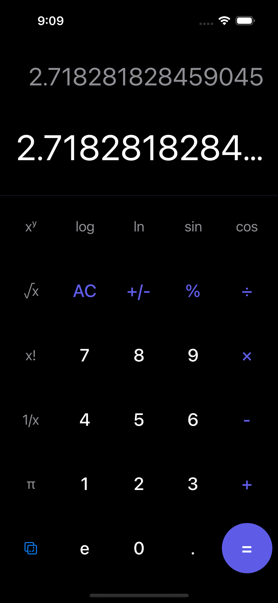

# Pazarama iOS Swift Bootcamp
## Homework 2 - Calculator

## Features

- Basic & Scientific Mode
- Latest result in a separate label
- Portrait orientation only
- Dark mode support

### Basic Mode

### Scientific Mode

### Display Latest Result Separately

### Dark Mode

#### Technologies Used

- Swift
- UIKit
- Storyboard

#### Methodologies

- MVC
- OOP

